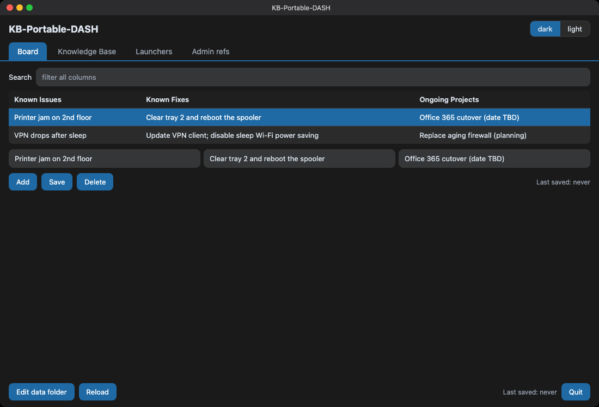
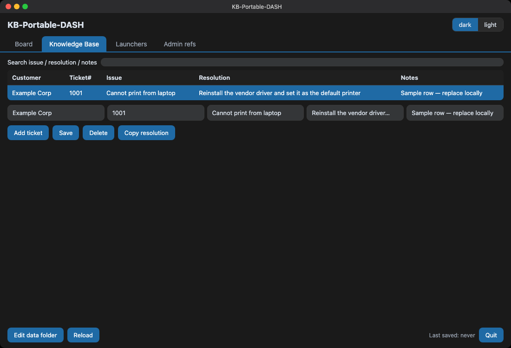
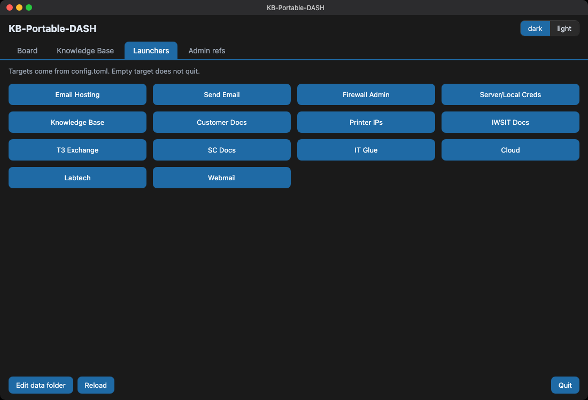
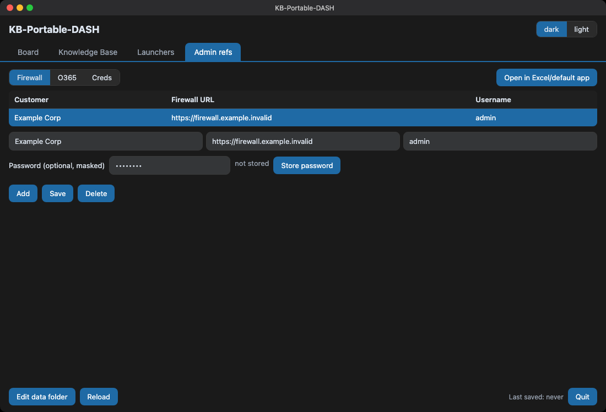

# KB-Portable-DASH

Offline, LAN-shareable helpdesk console for a tech sitting on a ticket.

A single CustomTkinter window over local SQLite + CSV files. Copy the folder onto a share, run it, keep working if the internet is down. GitHub repo: [cgfixit/KB-PORTABLE-DASH](https://github.com/cgfixit/KB-PORTABLE-DASH). Run with `python -m kbgui`.

## What it is

- Fast desktop console: **Board**, **Knowledge Base**, **Launchers**, **Admin refs**
- Footer: **Edit data folder**, **Reload**, **Quit**
- Data next to the app (or one folder you choose)
- CSV import/export so a tech can still dump/share a folder
- Windows 10/11 first, then macOS/Linux

## What it is not

- Not SaaS, not IT Glue, not CyClaw
- Not multi-user sync, Dropbox, or git-as-a-database
- Not a password manager, SSO, or cloud auth
- No telemetry. Source tree has no installer; each merge to `main` publishes a macOS `.app` zip on GitHub Releases (Developer ID + notarized once the repo secrets are set; Apple Silicon)

## Screenshots

macOS window layout (dark theme) with the shipped example rows. Windows 10/11 uses the same CustomTkinter tabs and footer. Live `screencapture` of the Tk window needs Screen Recording permission; these PNGs match the app labels and example CSVs.

**Board**



**Knowledge Base**



**Launchers**



**Admin refs**



## Run (Windows 10 / 11 / PowerShell)

From the repo folder. Python 3.12+ from [python.org](https://www.python.org/downloads/windows/) includes Tcl/Tk (tick it in the installer).

```powershell
.\run.ps1
```

If scripts are blocked: `Set-ExecutionPolicy -Scope CurrentUser RemoteSigned`.

Manual equivalent:

```powershell
py -3.12 -m venv .venv
.\.venv\Scripts\Activate.ps1
python -m pip install -e .
python -m kbgui
```

`python main.py` from the repo root starts the same app after install.

Confirm Tk: `python -c "import tkinter"`

## Run (macOS / Linux)

Homebrew `python@3.12` includes Tk. Pyenv builds often do not.

```bash
python3.12 -m venv .venv
source .venv/bin/activate
python -m pip install -e .
python -m kbgui
```

Confirm Tk: `python3 -c "import tkinter"`

## Config and launchers

1. Copy `config.example.toml` to `config.toml` next to `main.py` (`config.toml` is gitignored).
2. Fill each launcher `target` (`kind` is `url`, `folder`, `file`, or `command`).
3. Empty target: the app shows **set this in config** and does not quit.

Do not put passwords in `config.toml`.

## Data-dir contract

Resolve once, in this order:

1. Environment variable `KB_GUI_DATA_DIR`
2. `data_dir` in `config.toml` next to `main.py`
3. Directory containing `main.py` / the executable

SQLite lives at `<data_dir>/data/kb.sqlite`. First run copies `examples/*.example.csv` into that `data/` folder (gitignored) and imports them.

Footer **Edit data folder** writes `data_dir` into local `config.toml` and reloads.

## Secrets

Firewall / O365 / creds password columns are optional and shown masked.

- CSV and sqlite store **non-secret fields only** (customer, URL, username, …)
- Passwords persist only in the OS store (Windows Credential Manager / macOS Keychain)
- If the OS store is unavailable, the app **refuses to save the password** and says so in the UI
- There is no application-level encryption of plaintext passwords

Never put live passwords, API keys, or customer rows in git. Only `*.example.csv` templates are tracked.

## CI (Windows and macOS)

Test CI needs no secrets. Runners are **Windows Server** and hosted macOS, not a local Win10/11 desktop session, so they prove install/import/tests — not a clicked GUI. The macOS GitHub Release job on `main` needs Developer ID secrets (see below).

- `.github/workflows/ci-windows.yml` — ruff, pytest, compile, import Tk + CustomTkinter
- `.github/workflows/ci-macos.yml` — same
- `.github/workflows/ci.yml` — Linux ruff, pytest, compile (no Tk GUI import)

```bash
python -m pip install -e ".[dev]"
python -m ruff check .
python -m pytest
python -m compileall -q kbgui main.py
python -c "import kbgui"
```

## macOS GitHub Release

Each push to `main` runs `.github/workflows/release-macos.yml`: PyInstaller builds `KB-Portable-DASH.app`, signs it with **Developer ID Application**, notarizes with `notarytool`, staples the ticket, zips it, and publishes a GitHub Release tagged `macos-<sha7>`. Pull requests still build an **ad-hoc** `.app` so CI proves the packager without Apple secrets.

- Apple Silicon (the `macos-latest` runner). Not a universal binary.
- After notarization, Gatekeeper should allow a normal double-click. Until the six secrets below are set, **`main` release jobs fail closed** (they will not publish another ad-hoc zip).
- `config.toml` and `data/` live **next to** the `.app`, not inside the bundle.
- Local rebuild: `bash scripts/build-macos-app.sh` (Homebrew `python@3.12` with Tk). Set `CODESIGN_IDENTITY` to a Keychain Developer ID name to sign locally.

### GitHub Actions secrets (repo Settings → Secrets and variables → Actions)

These values never go in git. This Mac currently has **zero** Developer ID identities; create them in an Apple Developer Program account, then:

```bash
# Developer ID Application certificate exported from Keychain as cert.p12
base64 -i cert.p12 | gh secret set MACOS_CERTIFICATE -R cgfixit/KB-PORTABLE-DASH
printf '%s' 'EXAMPLEONLY' | gh secret set MACOS_CERTIFICATE_PWD -R cgfixit/KB-PORTABLE-DASH
printf '%s' 'EXAMPLEONLY' | gh secret set APPLE_TEAM_ID -R cgfixit/KB-PORTABLE-DASH

# App Store Connect API key (Users and Access → Integrations → Team Keys), AuthKey_XXXXXX.p8
base64 -i AuthKey_XXXXXX.p8 | gh secret set APP_STORE_CONNECT_API_KEY -R cgfixit/KB-PORTABLE-DASH
printf '%s' 'EXAMPLEONLY' | gh secret set APP_STORE_CONNECT_KEY_ID -R cgfixit/KB-PORTABLE-DASH
printf '%s' 'EXAMPLEONLY' | gh secret set APP_STORE_CONNECT_ISSUER_ID -R cgfixit/KB-PORTABLE-DASH
```

| Secret | What it is |
|---|---|
| `MACOS_CERTIFICATE` | base64 of Developer ID Application `.p12` |
| `MACOS_CERTIFICATE_PWD` | password for that `.p12` |
| `APPLE_TEAM_ID` | 10-character Team ID |
| `APP_STORE_CONNECT_API_KEY` | base64 of the `.p8` key |
| `APP_STORE_CONNECT_KEY_ID` | Key ID |
| `APP_STORE_CONNECT_ISSUER_ID` | Issuer ID (UUID) |

Official: [Using secrets in GitHub Actions](https://docs.github.com/en/actions/how-tos/write-workflows/choose-what-workflows-do/use-secrets), [Customizing the notarization workflow](https://developer.apple.com/documentation/security/customizing-the-notarization-workflow).
